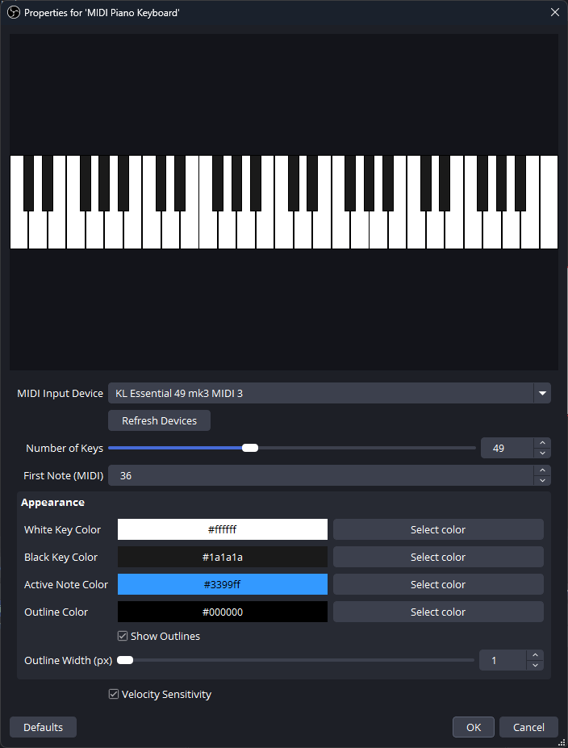

# obs-midikeyboard

OBS Studio plugin that turns your MIDI controller into a live on-screen piano keyboard. Press a key on your MIDI keyboard — see it light up on stream.

## Features

- **Real-time visualization** — low-latency rendering, notes light up as you play
- **Auto-reconnect** — unplug your MIDI device and plug it back; the plugin reconnects automatically
- **Multi-instance** — add the same keyboard to multiple scenes; they share one MIDI connection
- **Velocity sensitivity** — harder presses glow brighter (toggle on/off)
- **Fully customizable** — key colors, active note color, outline color and width
- **Adjustable range** — 25 to 88 keys, configurable starting note
- **Lightweight** — zero additional MIDI latency for other applications
- **Localized** — English and Russian



## Quick start

1. Download the latest installer from [Releases](https://github.com/hack1exe/obs-midikeyboard/releases)
2. Run the installer — it auto-detects your OBS installation
3. Launch OBS Studio
4. Add a new source → **MIDI Piano Keyboard**
5. Select your MIDI device in the source properties
6. Play — the keyboard lights up

## Manual installation

Drop these files into your OBS Studio directory (`C:\Program Files\obs-studio`):

| File | Destination |
|---|---|
| `obs-midikeyboard.dll` | `obs-plugins\64bit\` |
| `obs-midikeyboard\locale\en-US.ini` | `data\obs-plugins\obs-midikeyboard\locale\` |
| `obs-midikeyboard\locale\ru-RU.ini` | `data\obs-plugins\obs-midikeyboard\locale\` |

## Building from source

**Requirements:** CMake 3.28+, Visual Studio 2022

```powershell
cmake --preset windows-x64
cmake --build --preset windows-x64
```

The built plugin lands in `build_x64\rundir\RelWithDebInfo\`.

To build the installer:

```powershell
cmake --build --preset windows-x64 --target installer
```

Requires [Inno Setup 6](https://jrsoftware.org/isinfo.php).


GitHub Actions builds for Windows (`.exe` + `.zip`). The installer is signed with SHA256 checksums.

## License

GNU General Public License v2.0. See [LICENSE](LICENSE).

RtMidi is included under the MIT license.
