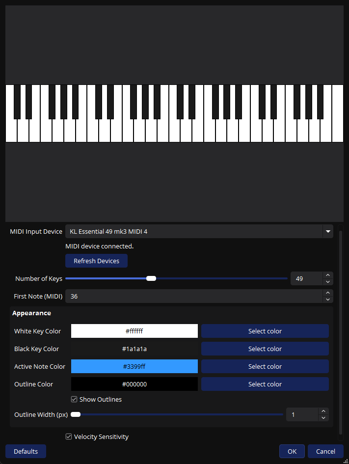
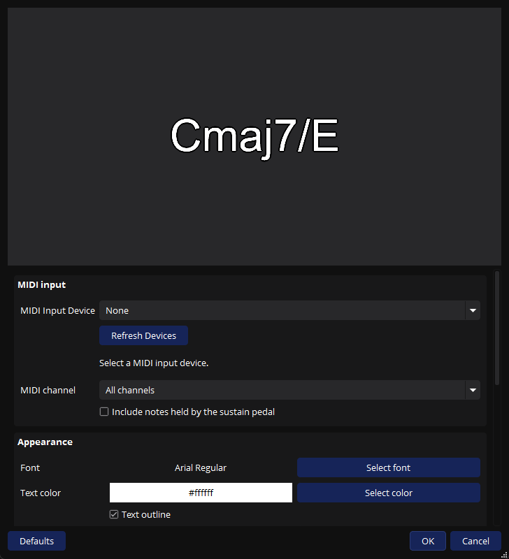

# obs-midikeyboard

OBS Studio plugin that turns your MIDI controller into a live on-screen piano keyboard. Press a key on your MIDI keyboard — see it light up on stream.

## Features

- **Real-time visualization** — low-latency rendering, notes light up as you play
- **Auto-reconnect** — unplug your MIDI device and plug it back; the plugin reconnects automatically
- **Multi-instance** — add the same keyboard to multiple scenes; they share one MIDI connection
- **Velocity sensitivity** — harder presses glow brighter (toggle on/off)
- **Fully customizable** — key colors, active note color, outline color and width
- **Adjustable range** — 25 to 88 keys, configurable starting note
- **Lightweight** — zero additional MIDI latency for other applications
- **Localized** — English and Russian
- **Chord labels** — a separate **MIDI: Chords (Beta)** source with inversions, channel selection, sustain support, and customizable text




## Quick start

1. Download the latest installer from [Releases](https://github.com/hack1exe/obs-midikeyboard/releases)
2. Run the installer — it auto-detects your OBS installation
3. Launch OBS Studio
4. Add a new source → **MIDI Piano Keyboard**
5. Select your MIDI device in the source properties
6. Play — the keyboard lights up

Keyboard ranges stay within MIDI notes `0..127`. The first-note control adapts to
the selected key count. Invalid saved ranges keep the key count (clamped to
25–88) and shift the starting note down to fit; outline widths are clamped to
1–4 pixels. Boundary black keys are fully included in the transparent canvas.
The device list retains a selected disconnected port when refreshed, and source
properties show whether the device is connected or waiting to reconnect.

## Chord labels

Add a **MIDI: Chords (Beta)** source and select your MIDI device. The keyboard and chord
sources share the connection when they select the same device. Position and scale
the chord label independently, or group it with the keyboard in OBS.

The source recognizes major/minor, diminished/augmented, suspended, sixth,
seventh, add9, ninth, and selected extended/altered chords. Inversions use slash
notation (`C/E`). Octave doublings do not change the chord; at least three distinct
pitch classes are required. Selected seventh and extended chords may omit the
perfect fifth, displayed explicitly as `(no5)`. All observed pitch classes must
fit the chosen template; absent roots and unsupported combinations are not guessed.

Some sets have multiple valid names: `C E G A` can be `C6` or `Am7/C`. The bass and
previous chord help choose a stable interpretation. These are chord labels for
the selected MIDI notes, rather than a full analysis of the musical context.

Source properties include:

- MIDI device and channel, plus an optional mode including sustain-held notes.
  The default analyzes physically pressed keys. Pedal mode includes all notes held
  by CC64, so a long pedal can combine successive harmonies.
- Font, text and outline colors, left/center/right alignment, and a fixed text area.
  Long labels shrink to fit; silence leaves an empty transparent area of the same size.
  Text uses a higher resolution raster and pixel-aligned placement. Enlarging the
  source increases the native font resolution up to 4x, subject to texture limits.
- Bass notation and sharp/flat spelling preferences.
- Stabilization delay (default 70 ms) and label hold time (default 180 ms).
  Continuous recognized changes have a bounded wait; unsupported sets clear the label.
- A sample `Cmaj7/E` for styling without a MIDI device. Turn this option off to show live chords.

Rendering uses OBS's Text (GDI+) or Text (FreeType 2) module. A missing text module
is reported in source properties. Device search and reconnect run on a shared
background worker, including when a source is hidden. Notes are tracked per MIDI
channel; CC64, CC120, CC121, CC123, and MIDI System Reset update their state.

## Manual installation

Drop these files into your OBS Studio directory (`C:\Program Files\obs-studio`):

| File | Destination |
|---|---|
| `obs-midikeyboard.dll` | `obs-plugins\64bit\` |
| `obs-midikeyboard\locale\en-US.ini` | `data\obs-plugins\obs-midikeyboard\locale\` |
| `obs-midikeyboard\locale\ru-RU.ini` | `data\obs-plugins\obs-midikeyboard\locale\` |

## Building from source

**Requirements:** CMake 3.28+, Visual Studio 2022

```powershell
cmake --preset windows-x64
cmake --build --preset windows-x64
```

The built plugin lands in `build_x64\rundir\RelWithDebInfo\`.

To build the installer:

```powershell
cmake --build --preset windows-x64 --target installer
```

Requires [Inno Setup 6](https://jrsoftware.org/isinfo.php).

To use an already installed libobs development SDK on Windows/macOS, configure
with `-DUSE_SYSTEM_LIBOBS=ON`, provide `libobs_DIR`, and include its dependencies in
`CMAKE_PREFIX_PATH`. This skips dependency bootstrapping while keeping the usual
`find_package` checks; the default build continues to use `buildspec.json`.

## Tests

The MIDI state machine, chord detector, and keyboard geometry can be tested without OBS or MIDI hardware:

```powershell
cmake -S tests -B build_tests
cmake --build build_tests --config Release --parallel
ctest --test-dir build_tests -C Release --output-on-failure
```

These tests cover transpositions/inversions, ambiguous names, omitted fifths,
channel isolation, sustain and reset messages, malformed MIDI, rolled chords,
label timing, device matching, all 4096 pitch-class sets, and all 4640 valid
keyboard ranges with safe outlines and complete boundary keys. GitHub Actions runs
them on Windows, macOS, and Linux. Add `-DBUILD_TESTING=ON` to a normal plugin build
to include the same test target.

An optional Windows integration test uses an installed OBS runtime and renders
the source offscreen. Configure the plugin with `-DBUILD_OBS_SMOKE_TESTS=ON` and
`-DBUILD_TESTING=ON`, build, then run from an output directory:

```powershell
$env:PATH = "C:\Program Files\obs-studio\bin\64bit;" + $env:PATH
.\tests\RelWithDebInfo\obs-chord-smoke.exe .\RelWithDebInfo\obs-midikeyboard.dll ..\data "C:\Program Files\obs-studio"
```

The command above assumes the current directory is the plugin build directory.
Append `freetype` to exercise the FreeType fallback. The test verifies native text
rendering, fonts and colors, outlines, transparency, alignment, fixed dimensions,
scene save/reload, keyboard rendering and range validation, shared source lifecycle,
and preservation of a selected disconnected port after refresh. It writes
`chord-preview.ppm` for inspection.
Physical MIDI delivery and USB unplug/replug still require a manual OBS check.


GitHub Actions builds for Windows (`.exe` + `.zip`). The installer is signed with SHA256 checksums.

## Changelog

### 1.0.1

- Added a separate **MIDI: Chords (Beta)** source with 36 chord templates, inversions,
  bass notation, selected omitted fifths, and sharp/flat spelling preferences.
- Added font, text and outline colors, alignment, a fixed transparent text area,
  automatic label fitting, and a sample chord for styling without a MIDI device.
- Improved chord text sharpness with higher resolution font rendering, adaptive
  raster resolution when enlarged, and pixel-aligned text and outline placement.
- Added configurable label stabilization and hold times, MIDI channel selection,
  and optional recognition of sustain-held notes.
- Fixed Note Off handling across MIDI channels and overlapping Note On messages;
  added sustain and MIDI reset message handling.
- Fixed keyboard range and outline validation for saved scenes, included complete
  boundary black keys in the source dimensions, and preserved disconnected device
  selections when refreshing the keyboard's device list. Added keyboard geometry tests.
- Fixed automatic reconnection after physically unplugging and reconnecting a MIDI
  device without restarting OBS, including stale WinMM connection state. Thanks to
  [@HaimD94](https://github.com/HaimD94) ([PR #1](https://github.com/axiomsound/obs-midikeyboard/pull/1)).
- Moved device search and reconnect to a shared background worker, including for
  hidden sources. Added unambiguous device matching and support for changed WinMM
  port numbers while sharing the connection between keyboard and chord sources.
- Added standalone MIDI/chord tests, a Windows/macOS/Linux test workflow, optional
  OBS rendering and scene save/reload checks, and the `USE_SYSTEM_LIBOBS` build option.

### 1.0.0

- MIDI piano keyboard visualization with a transparent background and a
  configurable range of 25–88 keys.
- Customizable key colors, outlines, and optional velocity-sensitive highlighting.
- Shared MIDI connections for multiple sources and automatic device reconnect.
- English and Russian localization, plus a local Windows installer.

## License

GNU General Public License v2.0. See [LICENSE](LICENSE).

RtMidi is included under the MIT license.
